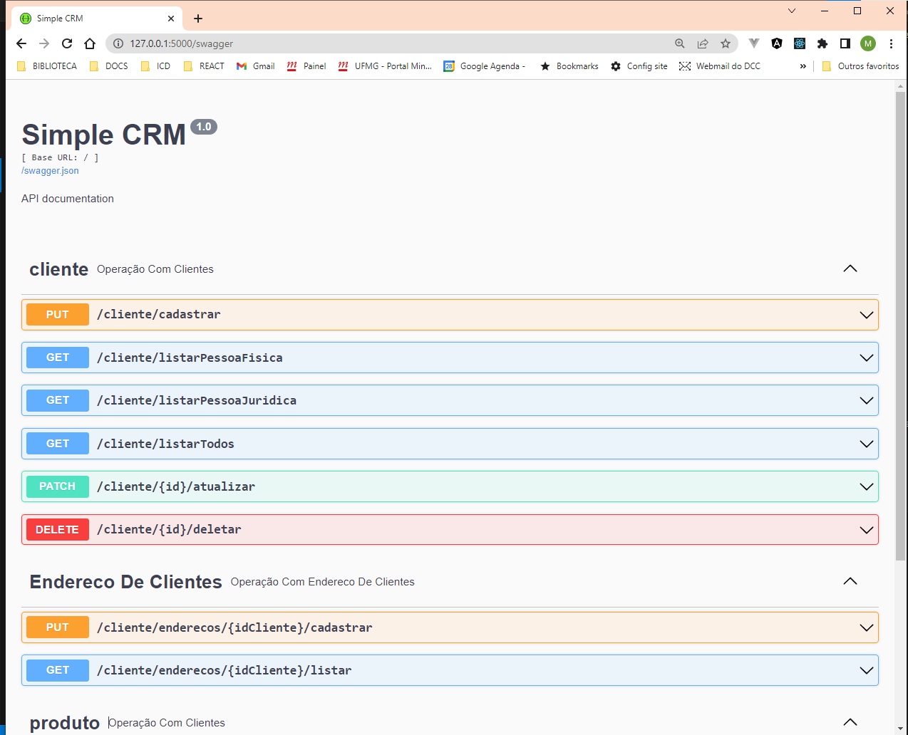

# Grupo:
Arthur Veloso Kuahara

Hilário Corrêa da Silva Neto

Matheus Schimieguel Silva

Renato Polanczyk Resende

Victor Vieira Brito

## Acesse a versao Publicada da API:
 [Documentação Swagger da Api Disponível Na Azure](https://simplecrm.azurewebsites.net/swagger)


## Acesse a Detalhes da Cobertura de Teste:
Disponivel em [codecov.io](https://app.codecov.io/github/mschimieguel/TrabalhoTesteSoftware)


# API em Flask-SQLite Com Documentação Swagger


## Container:
### Dependência:
* Docker
### Executando:
1. Construa a imagem:
```bash
$ docker build -t simple-flask-app:latest .
```
2. Execute o contêiner:
```bash
$ docker run -it -p 7776:7776 simple-flask-app
```
3. Acesse http:127.0.0.1:7776 para visualizar a aplicação executando localmente.

> Obs: Ao 'hostear' o sistema trocar o parâmetro `-it` (iterativo) por `-d` (detached) no comando run.

<br>

---

## Execução direta, com exemplo utilizando Ambiente Virtual(Linux):
### Dependência:
* Pytho 3.11
* Venv (sudo apt install python3.8-venv)
* pip (sudo apt install python3-pip)

### Gerenciando ambiente:
1. Criando ambiente:    `python3 -m venv ./venv`
2. Ativando ambiente:  `source venv/bin/activate`
3. Instalando dependências: `pip install -r requirements.txt`

### Executando:
1. Ativando ambiente:  `source venv/bin/activate`
2. Executando: `python3 run.py`
3. Desativando ambiente: `deactivate`


## Execução direta, com exemplo utilizando Ambiente Virtual(Windows):
### Dependência:
* instale o [Python 3.11 na loja da MicroSoft ](https://apps.microsoft.com/store/detail/python-311/9NRWMJP3717K)


### Gerenciando ambiente(abra um ternminal powershell):
1. Criando ambiente:    `python -m venv venv`
2. Ativando ambiente:  `.\venv\Scripts\Activate.ps1`
3. Instalando dependências: `pip install -r requirements.txt`

### Executando:
1. Ativando ambiente:  `.\venv\Scripts\Activate.ps1` (extensao do python do vscode automatiza a ativação do ambiente virtual)
2. Executando: `python run.py`


# A Documentacao Local da API (Swagger)

Acesse por http://127.0.0.1:5000/swagger



<br>

--- 

<br>

# Arquitetura e fluxo de execução:
### DevOps
* O arquivo `Dockerfile` é responsável por criar o contêiner para execução.
* O arquivo `requirements.txt` é responsável pelas dependências do projeto.
### Fluxo:
* O arquivo `run.py` na raiz do backend é executado, ele irá criar uma instância da aplicação.
* O método que cria a instância da execução está em `app/__init__.py`, que irá carregar todos os _blueprints_ dentro da intância da aplicação.
* Os blueprints, que se encontram em `app/routes/` são estruturas usadas pelo flask, se resumem a um conjunto de rotas da aplicação que são responsáveis pela parte da aplicação ou modelo dados.
* Os blueprints fazem uso dos modelos de dados para acessar o banco de dados.


--- 


## Fontes:
* https://www.serverlessops.io/blog/hello-serverless-a-beginning-python-flask-application

